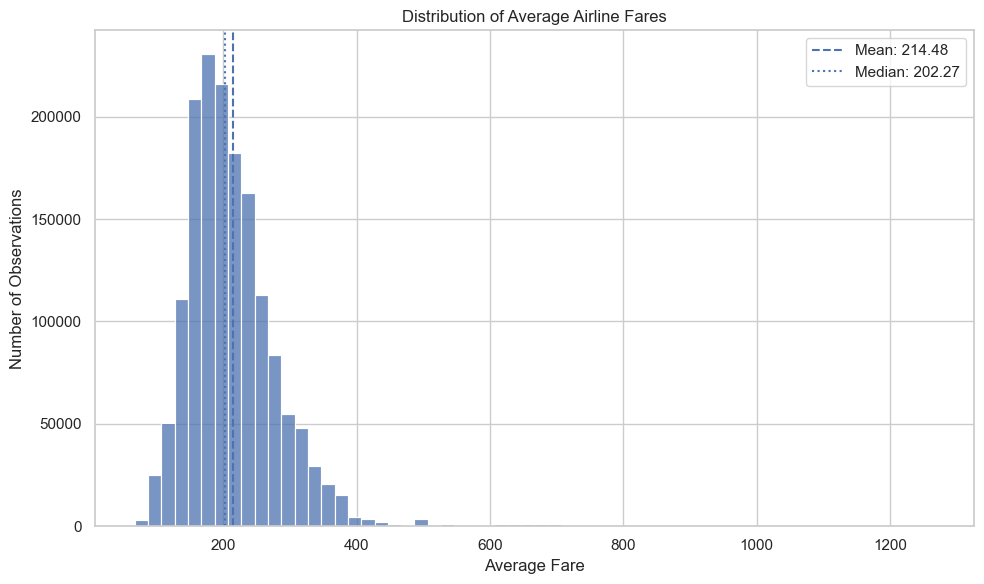
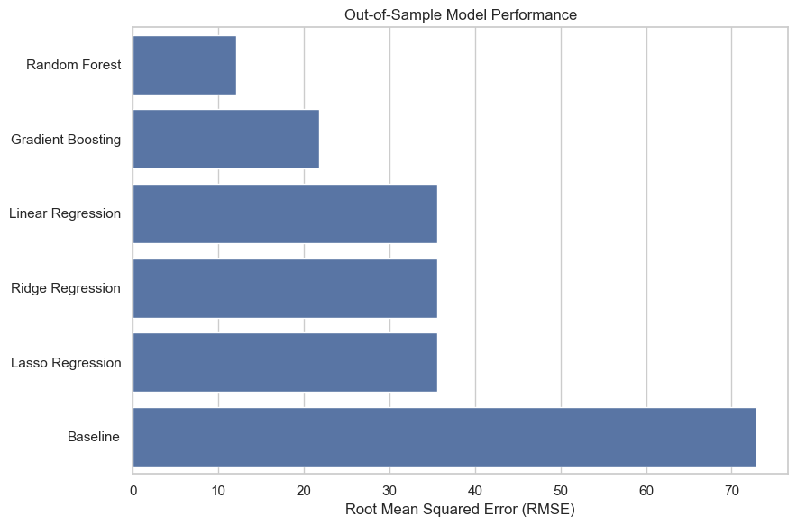
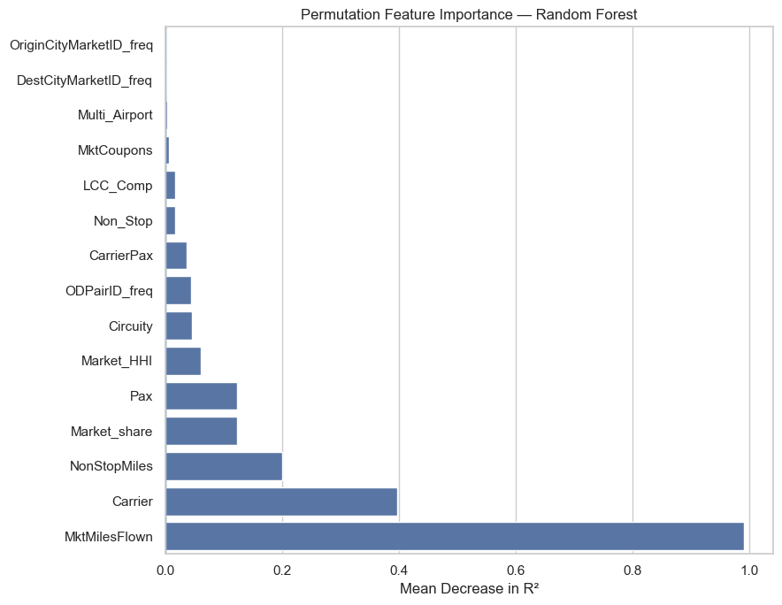
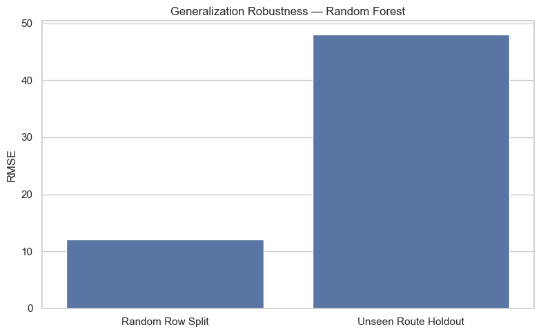

# Airline Fare Analysis and Prediction

Analysis of the factors associated with average airline fares using statistical and machine learning methods.

The project combines exploratory data analysis, regression modeling, ensemble methods, feature interpretation, residual diagnostics, and route-aware validation to examine both **what predicts airline fares** and **how well those predictions generalize**.

The analysis was developed from a final-year internship research project. It uses only publicly available U.S. airline market data and contains no confidential or proprietary airline data.

## Project Overview

Airline fares are influenced by more than route distance alone. Market structure, carrier characteristics, passenger demand, competition, and route properties can all contribute to observed price differences.

This project addresses two questions:

1. Which route, carrier, market, and competition-related characteristics are associated with average airline fares?
2. How accurately can statistical and machine learning models predict average fares?

The analysis compares:

- Mean baseline
- Linear Regression
- Ridge Regression
- Lasso Regression
- Random Forest Regression
- Gradient Boosting Regression

Models are evaluated using **MAE**, **RMSE**, and **R²**.

## Dataset

The project uses the **Airline Market Fare Prediction Data** dataset published by K. Gülnaz Bülbül.

- **Observations:** 1,581,278
- **Variables:** 26
- **Target:** `Average_Fare`
- **Source:** U.S. DOT Bureau of Transportation Statistics data derived from DB1B and T-100
- **Dataset:** https://data.mendeley.com/datasets/m5mvxdx2wp/2
- **License:** CC BY-NC 4.0

The complete CSV is approximately 382 MB and is therefore not stored in this repository.

See [`data/README.md`](data/README.md) for download and setup instructions.

## Exploratory Findings

Average fares are strongly right-skewed:

- Mean fare: **214.48**
- Median fare: **202.27**
- Skewness: **2.50**
- Maximum fare: **1,265.99**

Route distance shows the strongest simple linear relationship with average fare. Both `NonStopMiles` and `MktMilesFlown` have Pearson correlations of approximately **0.73** with the target.

Market concentration and carrier market share show weaker positive relationships.



## Modeling Strategy

A reproducible sample of **200,000 observations** is used for predictive modeling to keep ensemble training computationally practical.

Several methodological choices were made to improve model validity:

- all primary models use the same train-test observations;
- raw city, airport, and origin-destination identifiers are not treated as continuous numerical variables;
- `Carrier` is treated as a categorical feature;
- high-cardinality identifiers are represented using frequency encoding;
- frequency encodings are learned from training data only;
- numerical features are standardized for linear and regularized regression;
- tree-based models retain numerical variables on their original scale.

The project also includes a separate **route-grouped validation experiment** in which every test-set origin-destination route is absent from training.

## Model Performance

Performance on the standard random 80/20 train-test split:

| Model | MAE | RMSE | R² |
| --- | ---: | ---: | ---: |
| Random Forest | **6.8177** | **12.0763** | **0.9726** |
| Gradient Boosting | 15.7684 | 21.7481 | 0.9111 |
| Linear Regression | 23.3823 | 35.5802 | 0.7621 |
| Ridge Regression | 23.3823 | 35.5803 | 0.7621 |
| Lasso Regression | 23.3846 | 35.5917 | 0.7620 |
| Baseline | 51.7020 | 72.9521 | ~0.0000 |

Random Forest reduced RMSE by approximately **83.4%** relative to the mean-prediction baseline.

The progression from approximately **0.76 R²** for the linear models to **0.91** for Gradient Boosting and **0.97** for Random Forest indicates that nonlinear relationships and interactions contribute substantially to fare prediction.



## Model Interpretation

Permutation importance identifies the variables on which the Random Forest relies most strongly for held-out predictions.

The five most influential features are:

1. `MktMilesFlown`
2. `Carrier`
3. `NonStopMiles`
4. `Market_share`
5. `Pax`

This suggests that route distance is central to fare prediction, but carrier identity, passenger demand, and market structure also provide important predictive information.



Feature importance measures predictive contribution rather than causality.

## Generalization to Unseen Routes

The standard random split produces strong Random Forest performance, but it also contains substantial route overlap:

- **99.13% of test routes** also occur in training.
- **99.88% of test observations** belong to routes already represented in training.

To test a more difficult deployment scenario, a second validation split groups observations by `ODPairID`, ensuring that every test route is completely absent from training.

| Validation Strategy | Model | MAE | RMSE | R² |
| --- | --- | ---: | ---: | ---: |
| Random row split | Random Forest | 6.8177 | 12.0763 | 0.9726 |
| Unseen-route holdout | Random Forest | 25.5090 | 48.0128 | 0.6433 |
| Unseen-route holdout | Mean baseline | 55.0956 | 80.9450 | -0.0138 |

Under unseen-route validation, Random Forest RMSE increases by approximately **297.6%** and R² falls from **0.9726 to 0.6433**.

The model still substantially outperforms the unseen-route baseline, but the result demonstrates that predicting completely new routes is considerably harder than predicting additional observations from routes already represented during training.



This robustness experiment is an important part of the project: the headline random-split score should not be interpreted independently of the intended prediction scenario.

## Error Analysis

Random Forest predictions are close to unbiased overall:

- Mean residual: **-0.10**
- Median absolute error: **3.17**
- 90th percentile absolute error: **18.20**
- 95th percentile absolute error: **25.53**

Error increases at higher fare levels. The model tends to slightly overpredict the lowest fare quartile and underpredict the highest fare quartile, indicating some regression toward the center of the fare distribution.

## Data Quality and Limitations

The source dataset contains **1,517,905 exact duplicate rows among 1,581,278 observations**. These records were retained rather than removed from the published dataset.

This is particularly important for random row-level validation because identical observations can potentially occur in both training and test partitions, contributing to optimistic performance estimates.

The route-grouped holdout provides a stricter robustness test by preventing the same `ODPairID` from appearing in both partitions.

Other limitations include:

- the analysis is predictive rather than causal;
- fares are aggregated at market-carrier level rather than individual-ticket level;
- detailed city and airport names are unavailable in the processed dataset;
- models are trained on a 200,000-row sample rather than the complete dataset;
- ensemble hyperparameters are not extensively optimized.

A deduplicated sensitivity analysis would be a useful extension.

## Repository Structure

```text
airline-fare-analysis/
├── README.md
├── requirements.txt
├── .gitignore
│
├── data/
│   └── README.md
│
├── notebooks/
│   └── airline_fare_analysis.ipynb
│
└── reports/
    └── figures/
```

## Reproducing the Analysis

### 1. Clone the repository

```bash
git clone <repository-url>
cd airline-fare-analysis
```

### 2. Create a virtual environment

```bash
python -m venv .venv
```

Activate it on Windows:

```bash
.venv\Scripts\activate
```

On macOS or Linux:

```bash
source .venv/bin/activate
```

### 3. Install dependencies

```bash
pip install -r requirements.txt
```

The analysis was executed with:

- Python 3.14.0
- NumPy 2.4.1
- pandas 2.3.3
- Matplotlib 3.10.8
- Seaborn 0.13.2
- scikit-learn 1.8.0

### 4. Download the dataset

Follow the instructions in [`data/README.md`](data/README.md) and place:

```text
MarketFarePredictionData.csv
```

inside:

```text
data/
```

### 5. Run the notebook

Open:

```text
notebooks/airline_fare_analysis.ipynb
```

and execute the cells from top to bottom.

## Technologies

Python · pandas · NumPy · Matplotlib · Seaborn · scikit-learn · Jupyter Notebook

## License

The underlying **Airline Market Fare Prediction Data** dataset is not included in this repository and is distributed separately under the **CC BY-NC 4.0** license. See [`data/README.md`](data/README.md) for dataset attribution and licensing information.